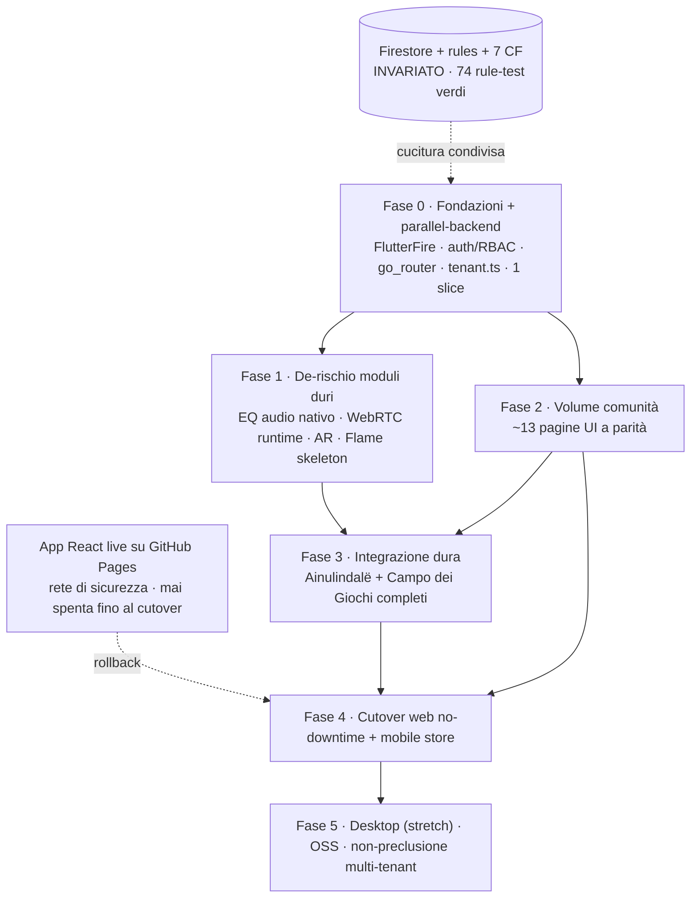

# Piano di migrazione marzio1777 → Flutter/Flame/Dart

> **Cos'è.** Il piano richiesto in §9 di `FLUTTER_MIGRATION_BRIEF.md`, prodotto **in locale**
> (plan mode multi-agente) il 2026-06-30 dopo che la sessione `/ultraplan` cloud si è interrotta
> al momento di chiedere alcune decisioni (rate-limit + teleport). È grounded sul codice reale del
> repo, sul brief (§0 decisioni, §0bis spike) e su `FLUTTER_SPIKE_FINDINGS.md`.
> **Stato:** proposta da revisionare/approvare. Non esegue nulla.

## Sommario decisionale (da approvare)

Le decisioni-chiave, già con raccomandazione motivata (dettagli in §2 e §3.8):

| # | Decisione | Raccomandazione | Exit path |
|---|---|---|---|
| Approccio | big-bang vs incrementale | **Strangler sul backend** (Firestore invariato), fette verticali, cutover web reversibile, mobile net-new | — |
| State mgmt | Riverpod / Signals / Provider / BLoC | **Riverpod** (`StreamProvider.family.autoDispose` = i 6 hook realtime 1:1) | Signals se il boilerplate pesa |
| Struttura | feature-first / Clean / layer-first | **Feature-first, 3 strati sottili** (il codice è già così) | — |
| Routing | go_router / Navigator 2.0 / auto_route | **go_router** (`StatefulShellRoute` per la shell) | — |
| Theming | ThemeData+tokens / hardcode / pkg | **ThemeData + ThemeExtension** (estingue la deriva di 70+ hex inline) | — |
| Vie di fuga | dove metterle | **Tassonomia a 3 livelli**; conditional import SOLO per audio + storage locale | — |
| **EQ audio nativo** | Rust+FFI condiviso vs flutter_soloud | **Opzione B (soloud) in fase 1**, interfaccia `AudioEngine` pronta per Rust+FFI dopo | → Rust+FFI se serve parità DSP perfetta |
| Backend | — | **FlutterFire 1:1**; `firestore.rules` + 7 CF + 74 rule-test **invariati** | — |
| Piattaforme | — | **web + mobile in fase 1**, desktop stretch | — |

**Scoperte sul codice reale (non nel brief):** `canvas-confetti` è una **dipendenza morta** (0 usi in `src/`); **Firebase Storage è in scope** (`IlBaule` carica foto) ma lo spike non l'ha testato → piccolo rischio aperto; **Gemini legge `localStorage`**, non `profile.apiKey` come dice la doc → disallineamento da sanare nel porting.

## 1. Fasi, sequenza e rischi

### Perché incrementale (strangler sul backend), non big-bang

La tentazione del big-bang — riscrivere tutto in Flutter e flippare l'interruttore — qui è da scartare per due fatti del repo. **Primo:** l'unica cosa che si proverà davvero è la *parità*, e parità di un'app in produzione (≈15.400 LOC, 23 pagine, 7 Cloud Functions, `firestore.rules` 616 righe) non si dimostra a fine corsa su un modulo ancora incerto — lo spike ha lasciato l'**EQ audio nativo come stub** (`flutter_soloud` espone un EQ grafico 8 bande, non le 3 biquad shelf/peaking di `audioEngine.ts`): scoprire a mese 5 che non si chiude farebbe crollare la storia mobile dopo aver già versato il volume UI. **Secondo:** React→Flutter è un *cambio di runtime*, non un refactor: non esiste uno strangler-fig pulito route-per-route dentro lo stesso bundle servito.

Lo strangler però esiste, e passa dal punto giusto: **il backend Firestore resta invariato** (decisione §0.1). La cucitura è il *data layer*, non la UI. L'app React live su GitHub Pages e l'app Flutter in costruzione parlano **allo stesso Firestore in parallelo**, sotto le stesse `firestore.rules` e gli stessi 74 rule-test (che non si toccano). Da qui la strategia: **costruzione incrementale a fette verticali contro il backend vivo, cutover scaglionato e reversibile per piattaforma**. La web si sostituisce solo a parità raggiunta (artefatto React tenuto come rollback); il mobile esce sugli store come *net-new*, senza alcun cutover a rischio. Marzio non si spegne mai prima della prova.

Conseguenza sull'ordine: **i moduli duri (audio, AR, WebRTC, giochi Flame) si de-rischiano subito dopo le fondazioni**, prima di pagare il volume delle pagine facili. Il volume è rischio basso e parallelizzabile; l'incertezza vera è concentrata e va sciolta presto.

### Fase 0 — Fondazioni e parallel-backend

- **Obiettivo:** scaffold Flutter (web+mobile dal `pubspec`), FlutterFire cablato sul **Firestore di produzione**, parità del modello auth zero-trust, e prova del loop end-to-end (`snapshots()` Dart → widget) su **una** fetta read-mostly. È la fase che valida il *processo*, non una feature.
- **Moduli inclusi:** `firebase_core`/`auth`/`firestore`/`messaging`/`cloud_functions`; porting di `AuthContext.tsx` + `useRBAC.ts` (Root-by-email duplicato in `firestore.rules:15` e `AuthContext.tsx:15` — da replicare 1:1 lato client); `src/config/tenant.ts` → `TenantConfig` Dart (seme multi-tenant, §0.4); route table di `App.tsx` → `go_router`; `ThemeData` + design tokens dal tema Tailwind inline; `ErrorBoundary`; primitive `ui/index.tsx` → widget; una slice (La Piazza: lettura post + like).
- **Dipendenze:** nessuna (spike già fatto, FlutterFire compila nel build web/linux).
- **Rischi:** parità del gating Root/Admin/Guest × pending/approved; il client **deve** filtrare `shareLiveLocation == true` (la rule lo assume); PWA/SW Flutter web ha **meno controllo** del SW Vite (FCM web richiede SW dedicato).
- **Fatto:** `flutter analyze` pulito, widget test verdi, build web **e** mobile verdi; La Piazza legge/scrive sul Firestore live in parallelo all'app React senza violare le rules; i **74 rule-test restano verdi** (backend invariato); gating ruoli identico all'originale.
- **Marzio live:** React resta su GitHub Pages; Flutter gira su URL/staging separato contro lo stesso DB. Impatto zero.

### Fase 1 — De-rischio dei moduli duri (da spike ad architettura)

- **Obiettivo:** trasformare lo spike in **API stabili e scelte vincolanti** prima del volume. Qui si chiudono le decisioni calde residue (§9.2): **EQ audio nativo** (Rust+FFI condiviso vs per-piattaforma) e **split storage** web/nativo. Si consolida l'interfaccia Dart unica + conditional import per ogni via di fuga.
- **Moduli inclusi:** AudioEngine (web: JS interop su Web Audio, già *reale* nello spike; nativo: `flutter_soloud` FFT + EQ da risolvere — il vero blocco); IndexedDB → `drift`/`isar` (nativo) + IndexedDB/OPFS (web); WebRTC (`flutter_webrtc`, signaling Firestore **invariato**); AR (`sensors_plus` + `flutter_compass`/fusione + `camera` con fallback); **skeleton Flame** per i due tipi di gioco (`eventState.ts`, `spawning.ts`, `geo.ts` → Dart).
- **Dipendenze:** Fase 0 (FlutterFire + shell).
- **Rischi:** l'EQ nativo è **il** punto (niente mapping 1:1, candidato Rust+FFI ma costoso); heading AR non calibrato (manca l'equivalente di `webkitCompassHeading`); il **"patto a 3"** del cap coda — oggi allineato fra `getMaxQueuedFor` (client), `enforceQueuePerUserLimit` (CF) e `effectiveMaxQueued` (rule) — acquista un **quarto sito Dart** che deve restituire lo stesso intero, pena `Missing or insufficient permissions` silenzioso; backpressure su `bufferedAmount`.
- **Fatto:** echo WebRTC round-trip **eseguito a runtime** (non solo compila) su web+mobile; audio web con spettro live nel browser **e** audio nativo con EQ funzionante (non stub) su mobile; cattura AR con fallback no-sensor; Flame: una cattura geolocalizzata + un round quiz end-to-end contro Firestore live, con `runTransaction` atomica e CF `validateCaptureDistance` ancora verde.
- **Marzio live:** tutto su staging, nessun cutover.

### Fase 2 — Volume comunità (le pagine facili)

- **Obiettivo:** parità delle ~13 pagine non-dure. È volume, non difficoltà; parallelizzabile su un secondo flusso una volta fissati i pattern di Fase 0.
- **Moduli inclusi:** La Piazza (completa), Il Bivacco, Il Baule (cropper), La Mappa (`flutter_map` + `geolocator`), Il Cinematografo, L'Alberone, Profilo, Admin/Root, Istruzioni (`flutter_markdown`); modali (`EventDetailModal`, `CreateEventModal`), `GestioneArchivio`.
- **Dipendenze:** solo Fase 0. **Indipendente dalla Fase 1** (corre in parallelo).
- **Rischi:** parità visiva Tailwind→`ThemeData`; volume; `date-fns`→`intl` (locale `it`); equivalenti di emoji-picker/markdown/cropper; il filtro `shareLiveLocation` lato client su La Mappa.
- **Fatto:** ogni pagina a parità funzionale contro Firestore live + widget test; rule-test invariati.
- **Marzio live:** staging.

### Fase 3 — Integrazione dura (Ainulindalë + Campo dei Giochi completi)

- **Obiettivo:** cablare le vie di fuga di Fase 1 dentro le pagine reali.
- **Moduli inclusi:** audio (`AudioSessionsList/Create/DJ/Listener`, `PersonalLibrary`, componenti `components/audio/*`, `djEngine.ts` con DI + loop); giochi (`IlCampoDeiGiochi`, `GameCreator`, `GameLobby`, `GamePlayRouter`, `TreasureHuntPlay`, `PhotoQuizPlay`, `GameResults`).
- **Dipendenze:** Fase 1 (interfacce dure) **e** Fase 2 (pattern UI/shell).
- **Rischi:** allineamento patto-a-3; scoring owner-side + flusso claim quiz (`usePhotoQuiz`); trasferimento P2P reale con blob veri web↔mobile; `notifyKickoff` FCM su mobile; immutabilità `finalLeaderboard`/`djBonusAwarded`.
- **Fatto:** una sessione DJ reale con trasferimento P2P di un brano vero web↔mobile; un treasure hunt **e** un photo quiz completi end-to-end; parità funzionale; rule-test invariati.
- **Marzio live:** staging.

### Fase 4 — Cutover web senza downtime + mobile store

- **Obiettivo:** portare la Flutter web a sostituire GitHub Pages e pubblicare il mobile come net-new. **Niente migrazione dati** (Firestore resta).
- **Dipendenze:** Fasi 2 + 3 (parità web completa).
- **Rischi:** PWA/SW Flutter web (meno controllo del SW Vite), FCM web SW dedicato, base path `/marzio1777/`, fallback 404 deep-link, pipeline GitHub Actions; review store mobile.
- **Fatto:** la URL canonica serve la build Flutter a parità piena; **rollback = ripuntare all'artefatto React** tenuto come fallback finché la web Flutter non è osservata stabile; mobile in TestFlight/store.
- **Marzio live:** cutover atomico e reversibile; React spento solo a stabilità confermata.

### Fase 5 — Desktop (stretch) + OSS-readiness + non-preclusione multi-tenant

- **Obiettivo:** build desktop (Linux verde post `libasound2-dev`; gap `camera` con fallback), completare OSS-readiness della destinazione, e **verificare la porta aperta al multi-tenant** (`TenantConfig` parametrizzabile, rules pronte ad accogliere `tenantId` una volta sola).
- **Dipendenze:** Fase 4.
- **Rischi:** camera assente su Linux (AR degradato, documentato); distribuzione desktop.
- **Fatto:** build desktop verde con AR degradato documentato; CI/CD + modello di contribuzione; checklist di non-preclusione §0.4 verificata.

### Dipendenze fra le fasi



### Milestone

| # | Milestone | Fase | Criterio di "fatto" verificabile | Marzio durante |
|---|---|---|---|---|
| M0 | Loop end-to-end provato | 0 | analyze pulito + build web/mobile verdi; La Piazza legge/scrive sul Firestore **live**; 74 rule-test verdi; gating ruoli identico | React live intatto |
| M1 | Moduli duri sciolti | 1 | echo WebRTC a **runtime**; audio web (spettro live) + EQ **nativo** funzionante; AR con fallback; cattura Flame atomica + CF verde; decisioni EQ-nativo e split-storage chiuse | staging, zero cutover |
| M2 | Parità comunità | 2 | ~13 pagine a parità funzionale + widget test; rule-test invariati | staging |
| M3 | Parità dura | 3 | sessione DJ con P2P di brano reale web↔mobile; treasure hunt + photo quiz completi; rule-test invariati | staging |
| M4 | Cutover web + mobile store | 4 | URL canonica su build Flutter a parità; rollback React pronto; mobile in TestFlight/store | cutover reversibile |
| M5 | Desktop + OSS + porta aperta | 5 | build desktop verde (AR degradato documentato); CI/CD + contrib model; checklist non-preclusione multi-tenant | post-cutover |

---

## 2. Decisioni-chiave di architettura (con raccomandazione motivata)

Il backend non è qui (deciso: resta FlutterFire, §0.1). Queste cinque decisioni governano il *client*, dove si gioca davvero la parità. Il filo conduttore: la logica di business di marzio1777 è **già disaccoppiata da React** — `DJEngine` è una classe con DI (costruttore che riceve `onStateChange`, `initiateTransfer`, `getServerTimestamp`… `src/utils/djEngine.ts:48`), `audioEngine`/`scoring`/`eventState`/`spawning`/`quizGenerators` sono Dart-ready 1:1, e i 6 hook realtime (`useGameEvents`, `useAudioSession`, `useAudioQueue`, `usePhotoQuiz`, `useSessionParticipants`, `useWebRTCTransfer`) sono sottili wrapper su `onSnapshot`. Quindi la scelta di state management tocca solo lo *strato reattivo sottile*, non il cuore — e questo abbassa il rischio di ogni decisione qui sotto.

### 2.1 State management

**Perché.** Lo stato attuale è `AuthContext` come **sola fonte** di `user`/`profile` (`src/contexts/AuthContext.tsx`, con fix anti-leak del listener via `profileUnsubRef`), `useRBAC` che ne **deriva** flag (`isRoot`/`isAdminOrRoot`/`isApproved`), e 6 hook che espongono **stream Firestore** + `useState`. Non c'è store globale: CLAUDE.md respinge esplicitamente redux/mobx/zustand ("context+hooks è dimensionato per ~10 utenti concorrenti"). Il target deve replicare tre cose: un singolo owner di auth+profilo, valori derivati, e molti stream `snapshots()` indipendenti e parametrizzati (`useAudioSession(id)`, `useGameEvents(filter)`).

| Alternativa | Pro | Contro rispetto al codice reale |
| --- | --- | --- |
| **Riverpod** | `StreamProvider` mappa 1:1 i 6 hook `onSnapshot`→`snapshots()`; `family` copre i parametri (`sessionProvider(id)`); `autoDispose` replica il cleanup degli hook; DI compile-safe identica al pattern `DJEngine`; provider derivati = `useRBAC`; test senza widget tree | Una dipendenza e un po' di sintassi (`ref.watch`) da imparare |
| **Signals** (`signals`/`flutter_signals`) | Ergonomia minima, fine-grained reactivity, leggero — affine alla ricerca del brief | Ecosistema giovane; integrazione con stream FlutterFire meno collaudata su un'app **in produzione**; meno materiale per i casi limite (race auth, dispose) |
| **Provider** | Leggero, ufficiale, curva bassa | Niente `family`/`autoDispose` nativi: i molti stream parametrizzati diventano boilerplate; nessuna DI compile-safe (errori a runtime) |
| **BLoC/Cubit** | Struttura rigida, ottimo per flussi a eventi complessi | Over-engineering per ~10 utenti e team piccolo: ogni hook diventerebbe un bloc + eventi + stati; tradisce il vincolo "vanilla/poche dipendenze" |

**Raccomandazione: Riverpod** (con **Signals come exit path** se in corso d'opera il boilerplate dei provider risultasse sproporzionato per le pagine semplici).
**Perché.** È l'unico che mappa *tutti* gli idiomi già presenti senza forzature: `StreamProvider.family.autoDispose` è letteralmente la firma dei nostri hook realtime; i provider derivati sono `useRBAC`; la DI per costruttore di `DJEngine` (scelta "per testabilità", commento nel sorgente) diventa `ref` senza riscrivere la classe. Massimizza il porting ~1:1 e tiene i test fuori dal widget tree, coerente con la suite esistente.

### 2.2 Struttura progetto e layering

**Perché.** Oggi il layout è *feature-flat*: `src/pages` (23 pagine), `src/hooks` (18), `src/utils` (logica pura), `src/lib` (Firebase, icone), `src/contexts`, `src/components/ui` (primitive scritte a mano), `src/config/tenant.ts`, `src/types.ts` + `src/types/audio.ts`. La separazione *UI ↔ hook (stream) ↔ util puri* è già un layering implicito a 3 strati. Lo spike ha già adottato un `lib/` a feature (`audio/`, `webrtc/`, `ar/`, `firebase/`).

| Alternativa | Pro | Contro |
| --- | --- | --- |
| **Feature-first + 3 strati leggeri** (`data`/`domain`/`presentation` per feature) | Rispecchia 1:1 le pagine come feature; gli util puri diventano `domain` portati senza modifiche; gli hook→repository+provider in `data`/`presentation` | Richiede disciplina nel non far perdere ai widget l'accesso diretto a Firestore |
| **Clean Architecture canonica** (entities/usecases/repos/datasources, interfacce ovunque) | Massimo disaccoppiamento, testabilità totale | Troppi strati e indirezioni per la dimensione del team/app; viola "vanilla"; rallenta la parità |
| **Layer-first** (`screens/`, `widgets/`, `services/` globali) | Familiare, semplice | Non scala con 3 domini grossi (Comunità, Giochi/Flame, Ainulindalë): tutto finisce in cartelloni piatti, come già un po' soffre `src/pages` |

**Raccomandazione: feature-first con tre strati sottili**, `lib/src/features/{comunita,giochi,ainulindale,...}/{data,domain,presentation}` + `lib/src/common/` (primitive UI, theming, router) + `lib/src/config/tenant.dart`.
**Perché.** Il codice è *già* organizzato così di fatto: i `src/utils/*` puri sono il `domain` e si portano intatti; i 6 hook-stream sono il `data`/repository; le pagine sono `presentation`. Mantenere il confine, non aggiungerne di nuovi, dà la parità più rapida senza l'ipertrofia di Clean. MVVM emerge gratis (un provider Riverpod = ViewModel di una vista), senza adottarlo come dogma.

### 2.3 Routing (go_router) e mappatura della route table

**Perché.** `src/App.tsx` ha l'intera tabella: `/` (Landing) pubblica; `/dashboard/*` dentro `<Layout/>` protetto da `ProtectedRoute` (redirect a `/` se `!user`); 11 voci + due gruppi nidificati — **Giochi** (`giochi`, `giochi/nuovo`, `giochi/:eventId/{lobby,play,results}`, con `GamePlayRouter` che smista su `event.type`) e **Ainulindalë** (`ainulindale/*` con un *router annidato dentro* `IlAinulindale.tsx`: `biblioteca`, `sessioni`, `sessioni/nuova`, `sessioni/:id`, `sessioni/:id/dj`, con `AudioSessionWrapper` che smista DJ vs Listener su `session.djId`). `basename` da `import.meta.env.BASE_URL` per `/marzio1777/`; deep-link su GitHub Pages tenuti in piedi dal trucco `404.html`.

| Alternativa | Pro | Contro |
| --- | --- | --- |
| **go_router** | URL-based (parità coi deep-link attuali); `ShellRoute`/`StatefulShellRoute` per la shell `Layout` + bottom-nav; `redirect` centralizzato = `ProtectedRoute`; param `:eventId`/`:id` 1:1 | Configurazione iniziale verbosa per i rami annidati |
| **Navigator 2.0 a mano** | Controllo totale | Si riscrive ciò che go_router già dà; più superficie di bug su un'app in produzione |
| **auto_route** (codegen) | Type-safe, meno boilerplate a regime | Dipendenza + build_runner; un layer di generazione in più contro "vanilla" |

**Raccomandazione: go_router.** Mappatura concreta:
- `redirect` globale legge il provider auth → sostituisce `ProtectedRoute` (un solo punto, niente guard sparse).
- **`StatefulShellRoute.indexedStack`** per `/dashboard`: la shell è `Layout`, ogni voce di nav è un branch con **stato preservato** — un *miglioramento* rispetto all'attuale `lazy()` che rimonta le pagine a ogni switch.
- I due router annidati (`ainulindale/*`, sotto-rotte giochi) diventano `routes:` figlie; `GamePlayRouter` e `AudioSessionWrapper` (smistamento su `event.type` / `session.djId`) diventano `builder` che leggono il provider del doc e scelgono la view — logica identica, posizione migliore.
- Web: `usePathUrlStrategy()` + `<base href>` per URL puliti; mantenere l'equivalente del fallback SPA `404.html` sull'hosting statico (vincolo "Marzio non regredisce" sui deep-link).

### 2.4 Theming (Tailwind v4 inline → ThemeData / design tokens)

**Perché.** `src/index.css` definisce in `@theme` la palette di brand `--color-marzio-{seppia,verde,oro,azzurro,grigio}` **più** un set di token semantici (`--color-background`, `--color-primary`, `--color-card`…) mappati sul tema *dark-flame* dell'Ainulindalë — con un commento che avverte: senza questi, Tailwind v4 droppa silenziosamente `.bg-primary` ("bug pagina nera"). Convivono **due superfici**: *seppia/giorno* (Comunità) e *notte/dark-flame* (Ainulindalë, forzata dal parent `bg-[#0A0A0F]`). Il dark mode è una classe `.dark` su `documentElement`, scritta da `Layout.tsx` e **osservata via `MutationObserver`** da `LaMappa`/`IlBaule`/`LAlberone`. Problema reale e load-bearing: **fortissima deriva di palette** — 72 occorrenze di `bg-[#2D5A27]`, 62 di `bg-[#111814]`, 51 di `bg-[#1a261f]`… contro appena ~9 usi dei token `marzio-*`. I colori sono per lo più hardcoded inline, non tokenizzati.

| Alternativa | Pro | Contro |
| --- | --- | --- |
| **`ThemeData` light/dark + `ThemeExtension` per i token di brand** | Idioma Flutter nativo; `Theme.of(context)` rimpiazza le classi; due superfici = due `ThemeData`; deriva dal `TenantConfig` (seme multi-tenant) | Richiede di *tokenizzare* in migrazione i 72+ hex inline (lavoro, ma una-tantum) |
| **Hardcodare i colori nei widget** (porting letterale del drift) | Veloce sul momento | Trasferisce la deriva in Dart; rende il multi-tenant theming impossibile; tradisce §0.4 |
| **Pacchetto di tema esterno** | Pronto | Dipendenza inutile; la palette è piccola e nostra |

**Raccomandazione: `ThemeData` (light=seppia, dark/scoped=dark-flame) + una `ThemeExtension` `MarzioColors`** che porta la palette `--color-marzio-*` e i token semantici, **derivata da `TenantConfig`**.
**Perché.** La migrazione è il momento giusto e a costo marginale-zero per **estinguere la deriva**: ogni `bg-[#2D5A27]` → `colors.verde`, ogni token semantico → `Theme.of(context)`. Il dark mode diventa `ThemeMode` (niente `MutationObserver`: gli osservatori in 3 pagine spariscono, sostituiti da rebuild reattivi). La superficie *dark-flame forzata* dell'Ainulindalë diventa un `Theme(...)` che avvolge solo quel sottoalbero — semantica identica al `bg-[#0A0A0F]` parent-forced attuale, ma esplicita. E legando i colori al `TenantConfig` si lascia aperta la porta del theming per-comunità (§0.4) senza fork.

### 2.5 Il pattern "vie di fuga" formalizzato

**Perché.** Lo spike lo ha già validato e gli ha dato una forma (`FLUTTER_SPIKE_FINDINGS.md`): **interfaccia astratta + factory + conditional import**, risolto a compile-time così che `flutter_soloud` non entri mai nel bundle web e `package:web` non entri nel build nativo. La regola d'oro non è "metti una via di fuga ovunque", ma: **conditional import solo quando l'API diverge davvero per piattaforma E nessun plugin la astrae**; altrimenti basta una **interfaccia con DI** (come il signaling, già `SignalingChannel` nello spike, impl Firestore in prod) o **un singolo plugin cross-platform**.

Forma canonica (dallo spike):
```dart
// audio_engine.dart  — interfaccia + factory
abstract class AudioEngine {
  factory AudioEngine() => createAudioEngine();   // dall'import condizionale
  Future<void> init();
  void setEq(double low, double mid, double high);
  Uint8List getFrequencyData();                   // 64 bin → visualizer 32-bar
}
// la riga che fa lo switch a compile-time:
import 'audio_engine_web.dart' if (dart.library.io) 'audio_engine_native.dart';
// audio_engine_web.dart    → dart:js_interop + package:web (Web Audio reale)
// audio_engine_native.dart → flutter_soloud (FFT reale; EQ candidato Rust+FFI)
```

Dove serve **davvero** (e dove no), fondato sullo spike e sui sorgenti:

| Modulo (sorgente) | Via di fuga? | Forma |
| --- | --- | --- |
| Audio engine (`utils/audioEngine.ts`, grafo `lowshelf 320 / peaking 1k Q0.5 / highshelf 3.2k / analyser fft128`) | **Sì, conditional import** | web = JS interop su Web Audio (reale, spike S); native = `flutter_soloud` (FFT reale, **EQ 3-bande candidato Rust+FFI** — la vera lacuna) |
| Storage audio locale (`utils/indexedDB.ts`) | **Sì, conditional import** | web = IndexedDB/OPFS; native = `drift`/`sqflite` + file |
| AR / orientamento (`useDeviceOrientation`, `useCameraStream`, `ARCaptureLayer`) | **Parziale** | `sensors_plus` cross + via di fuga sull'**heading calibrato** (web `webkitCompassHeading` vs native `flutter_compass`/fusione); **fallback no-sensor obbligatorio ovunque** |
| WebRTC (`utils/webrtc.ts`, `useWebRTCTransfer`) | **No (interfaccia, non conditional import)** | `flutter_webrtc` unica impl web+mobile+desktop; lo split è solo nel **signaling** (`SignalingChannel` → impl Firestore), DI come `DJEngine` |
| Firestore/Auth/FCM | **No** | FlutterFire 1:1 (spike: nessun attrito) |
| Mappa (`react-leaflet`), markdown/emoji/cropper, confetti | **No** | plugin cross-platform diretti (`flutter_map`, `flutter_markdown`, ecc.) |

**Raccomandazione.** Adottare la **tassonomia a tre livelli** dello spike e renderla esplicita nel piano: (1) **plugin cross-platform** quando esiste (default — Firestore, WebRTC, mappa); (2) **interfaccia + DI** quando l'impl varia ma il contratto è uno e gira nello stesso bundle (signaling, e in generale i confini "alla `DJEngine`"); (3) **interfaccia + factory + conditional import** *solo* per i due punti dove l'API è genuinamente per-piattaforma: **audio** (web JS interop ↔ native SoLoud/Rust) e **storage locale** (IndexedDB/OPFS ↔ drift/sqflite).
**Perché.** Concentra la complessità dove lo spike ha dimostrato che serve e la nega altrove, evitando di pagare il costo del conditional import su moduli che un plugin già copre. Tiene il confine Flutter↔via-di-fuga piccolo, ispezionabile e testabile — coerente con "il più possibile vanilla" e con il verdetto dello spike (regge web+mobile; desktop gamba debole su camera/EQ nativo, non sull'architettura).

---

## 3. Mappatura modulo-per-modulo (React → Flutter)

**Perché questa mappa.** La parità non si gioca sul backend (Firestore resta, porting client ~zero — §0.1), ma sul *confine* tra ciò che è puro Flutter e i quattro punti dove il browser fa cose che Flutter nativo non fa da solo. Questa sezione classifica ogni modulo reale del repo (verificato su `src/`, non sulla sola §8) come **PURO FLUTTER** o **VIA DI FUGA**, e in quel caso *quale*: JS interop (`dart:js_interop`+`package:web`), FFI (Rust/C), platform channel, o plugin pub.dev. Lo spike (§0bis) ha già provato a runtime i tre moduli più ostici; qui ne ereditiamo i verdetti.

**Legenda.** Effort `S` (<1g) · `M` (1-3g) · `L` (~1 settimana) · `XL` (>1 settimana). Rischio = probabilità di scoprire un buco di parità o un plugin che non regge.

> Tre scoperte sul codice reale, non nella tabella §8, che cambiano la mappa:
> 1. **`canvas-confetti` è una dipendenza morta**: presente in `package.json`, **zero usi in `src/`** (solo citata nei `public/docs/*.md`). Non è un modulo da portare — al più particelle Flame se in futuro la si vuole davvero. *(Verifica: `grep -rln confetti src/` → vuoto.)*
> 2. **Firebase Storage è in scope e lo spike NON l'ha testato.** `IlBaule.tsx` carica foto su Storage (`uploadString(..., 'data_url')`, prefisso `TENANT.storage.photosPrefix`). Serve `firebase_storage` (FlutterFire), assente dall'elenco pacchetti dello spike → piccolo rischio non de-rischiato.
> 3. **Gemini è usato in un solo punto** (`IlBaule.tsx`, caption immagine), e legge `localStorage.getItem('gemini_api_key')`, **non** `profile.apiKey` come dice la doc — disallineamento da sanare nel porting.

### 3.1 Shell, routing, stato, tema

| Modulo | Sorgente reale | Target Flutter | Tipo | Effort | Rischio |
|---|---|---|---|---|---|
| Route table + lazy + `ProtectedRoute` | `src/App.tsx`, `src/components/Layout.tsx` | `go_router` (route nidificate `ainulindale/*`, `giochi/:id/*`), `ShellRoute` per il Layout, redirect auth | PURO | M | basso |
| Auth/ruoli/zero-trust | `src/contexts/AuthContext.tsx`, `src/hooks/useRBAC.ts` | `Riverpod` (`StreamProvider` su `authStateChanges()` + `snapshots()` del profilo), DI per `isRoot/isAdmin/...` | PURO | M | medio (la migrazione legacy + leak-fix B7 vanno riportati 1:1) |
| Tema (Tailwind v4 inline, palette marzio, dark) | `src/index.css` (`@theme`), `tailwind-merge`/`clsx` | `ThemeData` + design tokens (seppia/verde/oro/azzurro/grigio), `ThemeMode` | PURO | M | basso |
| Primitive UI scritte a mano | `src/components/ui/index.tsx` | widget Material/Cupertino custom (Button varianti, Switch ARIA, Dialog) | PURO | M | basso |
| Config di dominio (seme multi-tenant) | `src/config/tenant.ts` | classe Dart `TenantConfig` immutabile + DI (non precludere §0.4) | PURO | S | basso |
| Live location opt-in | `AuthContext` → `user_locations/{uid}` | `geolocator` + scrittura Firestore condizionata a `shareLiveLocation` | VIA DI FUGA (plugin `geolocator`) | S | basso |

### 3.2 Pagine comunità

| Modulo | Sorgente reale | Target Flutter | Tipo | Effort | Rischio |
|---|---|---|---|---|---|
| Landing | `Landing.tsx` | scaffold + `signInWithPopup`→`signInWithProvider`/`google_sign_in` | VIA DI FUGA (plugin auth) | S | basso |
| La Piazza (feed post, like, commenti) | `LaPiazza.tsx`, `date-fns` | `ListView` + `snapshots()`, `intl`/`timeago` per date locale `it` | PURO | L | basso |
| Il Bivacco (eventi, RSVP, spese) | `IlBivacco.tsx`, `EventDetailModal.tsx`, `CreateEventModal.tsx` | form + modali + transazioni RSVP (rule cross-user già fixata, non toccare backend) | PURO | L | medio (logica RSVP/spese ricca) |
| Il Cinematografo (galleria media da `posts`) | `IlCinematografo.tsx` (query `posts`) | griglia/player; se video HTML5 → `video_player` | VIA DI FUGA (plugin `video_player` se ci sono video) | L | medio |
| L'Alberone (chat singolo canale + emoji) | `LAlberone.tsx` (`chats/alberone_principale/messages`, `emoji-picker-react` lazy) | `ListView` realtime + `emoji_picker_flutter`; badge unread | PURO | M | basso |
| **Il Baule** (upload+cropper+mappa+AI) | `IlBaule.tsx` (`react-easy-crop`, `firebase/storage`, `@google/genai`, leaflet picker) | `crop_your_image`/`image_cropper` + **`firebase_storage`** + `flutter_map` picker + `google_generative_ai` | VIA DI FUGA (plugin: cropper, storage, map; AI=HTTP puro) | XL | **alto** (cropper data-url→jpeg + Storage non testato dallo spike + AI) |
| Mappa Ricordi (Leaflet) | `LaMappa.tsx`, `react-leaflet`, `src/lib/leafletIcons.ts` | **`flutter_map`** + `geolocator`; marker `DivIcon`→`Marker` widget; z-index filtro → `Stack` | PURO (tile OSM via plugin) | M-L | basso (equivalente solido, confermato §8) |
| Profilo | `ProfiloPersonale.tsx`, `useUserGagliardetti`, FCM toggle | form + gamification + toggle FCM | VIA DI FUGA (FCM, vedi 3.7) | L | basso |
| Pannello Admin/Root | `AdminPanel.tsx` (approva utenti, set `apiKey`) | tabelle + write `users` gated da rule | PURO | M | basso |
| Istruzioni (doc in-app) | `Istruzioni.tsx` (`fetch` `public/docs/*.md` + `react-markdown`) | `flutter_markdown` + `rootBundle`/asset `docs/` (precache offline → asset bundle) | PURO | S-M | basso |

### 3.3 Il Campo dei Giochi (Flame)

| Modulo | Sorgente reale | Target Flutter | Tipo | Effort | Rischio |
|---|---|---|---|---|---|
| Hub giochi | `IlCampoDeiGiochi.tsx`, `useGameEvents.ts` | lista eventi + macchina a stati (vedi 3.6) | PURO | S | basso |
| Game Creator (wizard 3-step + mappa + preview spawn) | `GameCreator.tsx` (37KB), `useHighAccuracyPosition` | `PageView` wizard + `flutter_map` + preview `spawning` | VIA DI FUGA (geolocator/map) | XL | medio (file più grosso, validazioni step + range guard) |
| Game Lobby + PermissionsGate | `GameLobby.tsx`, `useSessionParticipants` | lobby realtime + gate permessi (gyro/cam/GPS) | VIA DI FUGA (permission_handler) | M | medio |
| Play router (A/B su `event.type`) | `GamePlayRouter.tsx` | switch widget su `type` | PURO | S | basso |
| **Treasure Hunt** (cattura AR geo) | `TreasureHuntPlay.tsx`, `useDeviceOrientation`, `useCameraStream`, `useHighAccuracyPosition`, `useWakeLock`, `useNearestItem` | **gioco Flame** overlay su camera + bussola; transazione cattura + CF `validateCaptureDistance` | VIA DI FUGA (AR, vedi 3.5) | XL | **alto** (heading calibrato + camera, gamba debole desktop) |
| **Photo Quiz** (host rotativo) | `PhotoQuizPlay.tsx`, `usePhotoQuiz.ts`, `QuizHostCreateRound.tsx` | UI quiz + `claimMyAnswerPoints`/`revealRound` owner-side (B7) | PURO | L | medio (split scoring owner-side delicato, rule-bound) |
| Risultati | `GameResults.tsx` | leaderboard immutabile | PURO | S | basso |
| Quiz generators (registry, oggi tutti `null`) | `src/utils/quizGenerators.ts` | porting 1:1 registry Dart (logica pura) | PURO | M | basso |

### 3.4 L'Ainulindalë (audio)

| Modulo | Sorgente reale | Target Flutter | Tipo | Effort | Rischio |
|---|---|---|---|---|---|
| Shell router DJ/Listener | `IlAinulindale.tsx` (`AudioSessionWrapper` smista su `djId===uid`) | route nidificate `go_router` + switch | PURO | S | basso |
| Biblioteca personale | `PersonalLibrary.tsx`, `useLocalLibrary`, `useAudioPlayer` | lista + Walkman state-level | VIA DI FUGA (storage locale, vedi 3.5) | M | medio |
| Lista sessioni | `AudioSessionsList.tsx`, `useAudioSession` | lista realtime | PURO | S-M | basso |
| Crea sessione | `AudioSessionCreate.tsx` | form + create doc | PURO | M | basso |
| Pannello DJ | `AudioSessionDJ.tsx`, `useAudioEngineRaw`, `useAudioQueue`, `DJEngine`, `useWakeLock` | engine + coda + DI (vedi 3.5/3.6) | VIA DI FUGA (audio+WebRTC) | L | alto |
| Listener | `AudioSessionListener.tsx`, `useWebRTCTransfer` | ricezione P2P + play | VIA DI FUGA (WebRTC+audio) | M | alto |

### 3.5 I moduli duri (le quattro vie di fuga)

| Modulo | Sorgente reale | Target — Web | Target — Nativo | Tipo | Effort | Rischio |
|---|---|---|---|---|---|---|
| **AudioEngine** (singleton, grafo EQ 3 bande + analyser fftSize 128) | `src/utils/audioEngine.ts`, `useAudioEngineRaw`, `useAudioPlayer` | **JS interop**: `dart:js_interop`+`package:web` sul Web Audio reale (provato dallo spike: grafo+EQ+FFT funzionanti) | `flutter_soloud` (init/play/FFT reali; **EQ stub**) — vedi decisione 3.8 | VIA DI FUGA (JS interop + plugin/FFI) | web S / nativo M-L | web basso / **nativo alto** |
| MediaSession + lock-screen | `useAudioPlayer.ts`, `useAudioEngineRaw.ts` | **JS interop** `package:web` MediaSession | **plugin** `audio_service` | VIA DI FUGA | M | medio |
| Wake Lock | `src/hooks/useWakeLock.ts` | `wakelock_plus` (web+nativo) | idem | VIA DI FUGA (plugin) | S | basso |
| **WebRTC P2P** (chunk 16KB, header meta, backpressure) | `src/utils/webrtc.ts`, `useWebRTCTransfer.ts` | **`flutter_webrtc`** (stesso codice web+mobile; echo round-trip portato fedelmente nello spike) | idem (linka anche Linux post-`libasound2-dev`) | VIA DI FUGA (plugin) | S-M | basso-medio (signaling Firestore invariato) |
| **Storage locale audio** (IndexedDB `marzio1777_audio` v1, store tracks+playlists) | `src/utils/indexedDB.ts`, `useLocalLibrary` | **JS interop**/`idb_shim` su IndexedDB o OPFS | **plugin** `drift`/`isar`/`sqflite` + blob su file | VIA DI FUGA (interfaccia Dart unica + conditional import) | M-L | medio (lo split web/nativo è una decisione-chiave, vedi 3.8b) |
| **AR / orientamento + camera** | `useDeviceOrientation.ts`, `useCameraStream.ts`, `ARCaptureLayer.tsx`, `useHighAccuracyPosition.ts` | `sensors_plus` + **fusione manuale**/`flutter_compass`; `camera` web | `sensors_plus`+`flutter_compass`; `camera` mobile; **desktop: camera assente → fallback** | VIA DI FUGA (plugin + Dart puro per la fusione) | mobile M / web M / desktop L | **alto** (no equivalente di `webkitCompassHeading` calibrato; fallback no-sensor obbligatorio ovunque) |

### 3.6 Logica pura (porta ~1:1, zero via di fuga)

| Modulo | Sorgente reale | Target Flutter | Tipo | Effort | Rischio |
|---|---|---|---|---|---|
| Macchina a stati eventi | `src/utils/eventState.ts` | funzione Dart pura (test 1:1) | PURO | S | basso |
| Scoring quiz (fixed/decay, floor 1pt) | `src/utils/scoring.ts` | funzione Dart pura | PURO | S | basso |
| Spawning (disk picking + min-sep) | `src/utils/spawning.ts` | Dart puro (`Random`, early-return count/radius ≤0) | PURO | S | basso |
| Geo (Haversine + bearing) | `src/utils/geo.ts`, `src/lib/geoUtils.ts`, `useHaversineDistance` | Dart puro | PURO | S | basso |
| **DJEngine** (class con DI + `setInterval(1000)`) | `src/utils/djEngine.ts` | classe Dart con stessa DI (`onStateChange`, `initiateTransfer`, `getServerTimestamp`…) + `Timer.periodic` | PURO | M | basso (già DI ✅, porta pulito) |
| Cap dinamico coda ("patto a 3") | `useAudioQueue.ts:getMaxQueuedFor`, allineato a CF + rule | `getMaxQueuedFor` Dart — **stessa formula esatta** dei 3 siti, altrimenti la rule respinge | PURO | S | medio (drift silente se diverge dalla rule/CF) |
| ID3 parser | `src/utils/id3.ts` | Dart puro (parsing byte) o `audiotagger` nativo | PURO | M | basso |
| Quiz generators registry | `src/utils/quizGenerators.ts` | Dart puro | PURO | M | basso |

### 3.7 Backend e integrazioni (riuso, non riscrittura)

| Modulo | Sorgente reale | Target Flutter | Tipo | Effort | Rischio |
|---|---|---|---|---|---|
| Firestore realtime | tutti gli hook (`onSnapshot`) | `cloud_firestore` `snapshots()` 1:1 (provato dallo spike, nessun attrito) | VIA DI FUGA (plugin FlutterFire) | — (incrementale) | basso |
| Auth + Cloud Functions callable | `src/lib/firebase.ts`, `useGameEvents`, `useAudioQueue` | `firebase_auth`, `cloud_functions` (`validateCaptureDistance`, `enforceQueuePerUserLimit`) — **CF invariate** | VIA DI FUGA (plugin) | M | basso |
| **Firebase Storage** (foto) | `IlBaule.tsx` (`uploadString data_url`) | **`firebase_storage`** (`putString`/`putData`) | VIA DI FUGA (plugin) | M | **medio (non testato dallo spike)** |
| FCM Web Push + opt-in | `src/hooks/useFCM.ts`, `public/firebase-messaging-sw.js`, VAPID hardcoded | `firebase_messaging`; **web: service worker dedicato** (meno controllo della PWA Vite ⚠️) | VIA DI FUGA (plugin + SW/JS su web) | M-L | medio |
| Gemini per-utente | `IlBaule.tsx` (`@google/genai`, legge `localStorage`) | `google_generative_ai` (HTTP, Dart puro); sanare lettura chiave → `profile.apiKey` | VIA DI FUGA (plugin HTTP, banale) | S | basso |
| PWA / offline | `vite.config.ts` (`vite-plugin-pwa`, precache `docs/*.md`) | Flutter Web PWA + service worker; precache asset | VIA DI FUGA (config web) | M | medio (meno controllo del workbox attuale) |

### 3.8 Decisioni-chiave residue (perché prima del come)

**(a) EQ audio nativo — Rust+FFI condiviso vs `flutter_soloud` per-piattaforma.**
Il problema, verificato dallo spike: sul **web** l'EQ a 3 bande (lowshelf 320 / peaking 1k Q=0.5 / highshelf 3.2k) è *reale e gratis* via Web Audio (JS interop). Sul **nativo** `flutter_soloud` dà FFT reale ma il suo EQ è un equalizzatore **grafico a 8 bande**, non le 3 biquad shelf/peaking dell'app → niente drop-in, oggi è stub.

- *Opzione A — Rust+FFI condiviso.* Un crate DSP (3 `BiquadFilter`) compilato a `.so/.dylib/.dll/.a` (FFI nativo) **e** a WASM (web). Un'unica implementazione, suono identico byte-per-byte su tutte le piattaforme, EQ esatto come oggi. Costo: toolchain Rust + `flutter_rust_bridge`/`dart:ffi`, gestione del ciclo di vita FFI, ABI per OS. È la via "vanilla nel risultato, complessa nel build".
- *Opzione B — `flutter_soloud` per-piattaforma.* Si accetta l'8-band di SoLoud sul nativo (o si concatenano biquad sopra il suo grafo) e si tiene la JS-interop sul web. Due implementazioni divergenti, suono *simile* ma non identico, nessun build extra. Costo: parità EQ approssimata + version-pin (4.x richiede Dart ≥3.11, oggi 3.10.8 → bloccato a 3.5.4).

> **Raccomandazione: Opzione B per la fase 1, con interfaccia Dart pronta per la A.** Il web (dove sta oggi Marzio) ha già l'EQ reale a costo zero; il nativo arriva dopo (mobile è fase 1 ma l'audio DJ non è il primo modulo a spedire). Introdurre Rust+FFI *adesso* aggiunge una toolchain a un'app in produzione per un guadagno (3 bande esatte vs 8 bande "buone") che l'utente di paese non distingue. **Però**: si tiene `setEq(low, mid, high)` come unico punto dietro l'interfaccia `AudioEngine` Dart, così che sostituire SoLoud con il crate Rust sia un cambio di una sola impl, non un refactor. Si passa alla A solo se/quando l'EQ nativo diventa una lamentela reale o serve parità DSP perfetta cross-platform. *(Coerente con §5 "vanilla" e con la regola "preferire native, valutare il costo".)*

**(b) Split storage locale audio — decisione gemella.** Stessa forma del problema audio: web ha IndexedDB nativo, il nativo no. Raccomandazione: **interfaccia Dart unica `LocalLibraryStore`** con conditional import — web su IndexedDB/OPFS (riuso dello schema `marzio1777_audio` v1, store `tracks`+`playlists`), nativo su `drift` (SQLite, query/index come gli indici IndexedDB attuali) + blob audio su filesystem. Mai file audio su Firestore/Storage (regola non negoziabile dell'Ainulindalë). Effort M-L, rischio medio: il punto delicato è mantenere identica la semantica di `searchTracks`/sort `uploadedAt` su due backend.

**File chiave su cui è fondata questa mappa:** `/home/neo1777/Scrivania/marzio1777-main/src/utils/audioEngine.ts`, `.../src/utils/indexedDB.ts`, `.../src/utils/djEngine.ts`, `.../src/utils/webrtc.ts`, `.../src/utils/{eventState,scoring,spawning,geo}.ts`, `.../src/hooks/useDeviceOrientation.ts`, `.../src/pages/IlBaule.tsx`, `.../src/pages/LAlberone.tsx`, `.../src/pages/IlCinematografo.tsx`, `.../src/config/tenant.ts`, `.../src/App.tsx`, `.../src/components/Layout.tsx`, `.../package.json`.

---

## 4. Backend Firebase via FlutterFire (invariato)

**Perché.** Il backend è il fulcro della scelta §0.1: `firestore.rules` (616 LOC), le 7 Cloud Functions e i 74 rule-test sono l'artefatto caro e pericoloso. Restano *byte per byte* dove sono. La parità si gioca tutta nel client Dart, che deve parlare la **stessa identica lingua di scrittura** del client React — stesse shape, stessi campi, stessi invarianti — perché è la rule a giudicarlo, non l'app. Il porting client è "~zero" proprio perché FlutterFire espone le stesse primitive di `firebase` v12 già in uso in `src/lib/firebase.ts`.

### 4.1 Inizializzazione (`src/lib/firebase.ts` → Dart)
Oggi `initializeApp` legge 6 variabili `import.meta.env.VITE_FIREBASE_*`; `initializeFirestore` monta `persistentLocalCache({ tabManager: persistentMultipleTabManager() })`; `getFunctions(app,'europe-west1')`. Mappa:

| Oggi (web/React) | Target (Dart/FlutterFire) |
| --- | --- |
| `firebaseConfig` da `import.meta.env.VITE_FIREBASE_*` | `DefaultFirebaseOptions` in `firebase_options.dart` (generato da `flutterfire configure`); su native via `google-services.json` / `GoogleService-Info.plist` |
| `initializeApp` | `Firebase.initializeApp(options: DefaultFirebaseOptions.currentPlatform)` |
| `persistentLocalCache` + `persistentMultipleTabManager` | `FirebaseFirestore.instance.settings = Settings(persistenceEnabled: true, …)`; su web il multi-tab è il comportamento di default della cache web |
| `getFunctions(app,'europe-west1')` | `FirebaseFunctions.instanceFor(region:'europe-west1')` |
| `.env` build-time | `firebase_options.dart` + `--dart-define` per i valori per-istanza (vedi §6) |

### 4.2 Realtime: `onSnapshot` → `snapshots()` (1:1)
Il realtime è pervasivo: **53 `onSnapshot` in ~20 file** (`LaPiazza`, `IlBivacco`, `LaMappa`, `IlCinematografo`, `LAlberone`, `AdminPanel`, `GameLobby`, `TreasureHuntPlay`, `usePhotoQuiz`, `useGameEvents`, `useAudioQueue`, `useAudioSession`, `useSessionParticipants`, `useWebRTCTransfer`, `AuthContext`…). Ogni listener mappa 1:1 su uno **Stream** Dart:
- `onSnapshot(query, cb)` → `Query.snapshots()` → `Stream<QuerySnapshot>`, consumato da `StreamBuilder`/Riverpod `StreamProvider`.
- `onSnapshot(doc, cb)` → `DocumentReference.snapshots()`.
- Le query composite reali — es. `LaPiazza`: `query(collection, and(where('visibilityStatus','in',[…]), where('authorId','==',uid)), orderBy('timestamp','desc'), limit(50))` — hanno equivalente diretto (`.where().orderBy().limit()`, `Filter.or`/`Filter.and`). **Gli indici composti in `firestore.indexes.json` restano validi**: stesse query, stessi indici.
- L'unsubscribe (oggi `return () => unsub()` in `useEffect`, e il fix del leak con `profileUnsubRef`) diventa `StreamSubscription.cancel()` nel `dispose()` o automatico via `StreamProvider.autoDispose`.

### 4.3 Auth (`firebase_auth`)
`AuthContext` è la sola fonte di `user`/`profile`: `auth.onAuthStateChanged` + un `onSnapshot(users/{uid})` per il profilo, più le migrazioni (Root-by-email `nicolainformatica@gmail.com`, default `Guest`+`pending`, cutoff legacy). Mappa:
- `onAuthStateChanged` → `FirebaseAuth.instance.authStateChanges()` (`Stream<User?>`).
- `loginWithGoogle` = `signInWithPopup(GoogleAuthProvider)` → su **web** `signInWithPopup`; su **mobile** `signInWithProvider`/`google_sign_in` (via di fuga di piattaforma, non di codice business).
- La logica di migrazione/zero-trust resta **client-side identica** in Dart; l'autorità resta la rule (`isRoot()` su `request.auth.token.email`) — **non si tocca**.
- Il listener profilo conserva l'ownership esclusiva della creazione doc (come oggi): il login non scrive il profilo.

### 4.4 Cloud Functions (`cloud_functions`)
7 CF live su `europe-west1`, `nodejs22`. Restano **codice JS deployato invariato**: il client le invoca soltanto. Due sole sono chiamate dal client:
- `validateCaptureDistance` (Haversine server-side) — `useGameEvents.captureItemTransaction:278`, con **fallback graceful** se non deployata.
- `enforceQueuePerUserLimit` (count effettivo coda, il "patto a 3") — `useAudioQueue:98,210`, anch'essa con fallback.

Mappa: `httpsCallable<Req,Res>('nome')` → `FirebaseFunctions.instanceFor(region:'europe-west1').httpsCallable('nome').call(<Map>)`. Il **fallback graceful va portato fedelmente** (catch `not-found`/`unavailable` → legacy fast-path): è parte del contratto. Le altre 5 (`notifyKickoff`, `cleanupOrphanSignaling`, `cleanupStuckEvents`, `cleanupOrphanSessions`, `auditMassSkip`, + skeleton `validateP2PTransferIntegrity`) sono cron/trigger server-side: **invisibili al client**, nessun porting.

### 4.5 FCM Web Push + mobile (`firebase_messaging`)
Oggi `useFCM.ts` fa `getToken({vapidKey, serviceWorkerRegistration})`, `onMessage` in foreground, persiste su `users/{uid}.fcmTokens[]` via `arrayUnion`/`arrayRemove` (cap 20); il SW dedicato `public/firebase-messaging-sw.js` (gstatic compat) gestisce `onBackgroundMessage` + `notificationclick`. Mappa:
- **Web**: `FirebaseMessaging.instance.getToken(vapidKey: …)`; serve **ancora un SW** `web/firebase-messaging-sw.js` — si **riusa quello esistente** (stesso scope `BASE_URL`, stessa VAPID public key hardcoded `BHyT0BSV…`). Attenzione alla coabitazione con il SW di Flutter web (`flutter_service_worker.js`), come oggi coabita con quello di Vite-PWA: registrazioni diverse, stesso scope.
- **Mobile**: push nativo (FCM Android, APNs iOS) — niente VAPID/SW; `FirebaseMessaging.onMessage`/`onBackgroundMessage`.
- La persistenza token su `users/{uid}.fcmTokens[]` (`arrayUnion`/`arrayRemove`) e l'opt-in in `ProfiloPersonale` restano invariati: la CF `notifyKickoff` continua a leggere lo stesso campo.

### 4.6 Perché rules e 74 rule-test restano validi
Le rule e i loro test sono **server-side e client-agnostici**: girano sull'emulator Firestore via `@firebase/rules-unit-testing` (`initializeTestEnvironment` + `readFileSync('firestore.rules')`), eseguiti da `node:test`+`tsx`. Non sanno né gli importa se il client è React o Flutter. Restano validi **a condizione che il client Dart scriva le stesse shape**: in particolare gli invarianti load-bearing già documentati — `effectiveMaxAtCreate is int` uguale a `effectiveMaxQueued(sessionId)` (il "patto a 3"), `affectedKeys().hasOnly([...])` su like/RSVP/queue.update, identità pinnata (`data.<campo> == <docId>`), `Math.floor` al boundary per i campi `is int`. **I rule-test NON si portano in Dart**: restano in TypeScript nel repo, parte invariata della suite backend (§5).

---

## 5. Strategia di test

**Perché.** "Test adatti alla destinazione" non significa riscrivere tutto: significa portare in Dart ciò che è logica di client, e **lasciare intatto** ciò che prova il backend. La piramide ha quattro piani, due nuovi (Dart) e due conservati (JS/emulator).

### 5.1 Unit Dart (porting 1:1 dei 66 vitest)
La logica pura è la parte che porta più pulita. I 66 unit test verdi (`src/__tests__/games/utils.test.ts` su `geo`/`spawning`/`scoring`/`eventState`; `audio/{id3,indexedDB,audioEngine,useAudioQueue}`) diventano `package:test` Dart:
- `geo`/`spawning`/`scoring`/`eventState` → funzioni pure Dart, edge case identici (antimeridiano, time-bandit, terminal states, `count=0`/`radius=0`, floor 1pt universale).
- **Il "patto a 3" è il test critico**: `getMaxQueuedFor(points, rules)` (oggi `useAudioQueue.ts:11`) va testato in Dart per garantire che restituisca **lo stesso intero** della rule `effectiveMaxQueued()` e della CF `enforceQueuePerUserLimit`. Un disallineamento qui = `queue.create` respinta silenziosamente.
- `id3` (parsing) e la formula del cap: pura logica, porting diretto.

### 5.2 Widget test (`flutter_test`)
Coprono le 23 pagine/componenti che oggi non hanno equivalente test (la suite React è logica, non rendering): `pumpWidget` + golden test mirati per le UI a stato (wizard `GameCreator` step-validation, `Dialog` dvh-aware, empty-state guest, hint datetime kickoff). Firestore mockato con `fake_cloud_firestore` per i widget data-driven.

### 5.3 Integration test (`integration_test`)
Per i flussi end-to-end realtime/auth/CF si gira **contro l'emulator Firestore+Auth** (già configurato in `firebase.json`: porte firestore/auth), `useFirestoreEmulator`/`useAuthEmulator` lato Dart. Flussi prioritari (i più rischiosi): cattura item transazionale (un solo vincitore), claim punti quiz owner-side, `queue.create` col cap dinamico, RSVP cross-user. Questo è anche il banco dove si verifica la **non-regressione di Marzio**: stesse shape ⇒ rule verdi.

### 5.4 Rule-test: restano in TypeScript, restano verdi
**Non si portano.** I 74 rule-test (`firestore.rules.test.ts` + `firestore.rules.audio.test.ts`) provano il backend, non il client: restano nel repo eseguiti come oggi —
`firebase emulators:exec --only firestore "npx tsx --test firestore.rules.test.ts firestore.rules.audio.test.ts"` (JDK 21+). Vanno tenuti verdi come **gate del cutover**: se il client Dart scrive una shape sbagliata, sono i rule-test (più gli integration test §5.3) a coglierlo prima del deploy. Analogamente le 7 CF restano testabili sull'emulator functions (`functions/` è invariato).

### 5.5 Test dei moduli "a via di fuga"
Qui sta il rischio nuovo, e va testato in modo specifico per il pattern conditional-import:
- **Contratto sull'interfaccia astratta**: ogni via di fuga (`AudioEngine`, `SignalingChannel`, `OrientationService`) ha un test sul contratto Dart, indipendente dall'impl.
- **Doppia impl analizzata insieme**: `flutter analyze`/`flutter test` validano *entrambe* le implementazioni (web e native) anche se solo una entra nel bundle — è già l'esito dello spike.
- **Audio**: web → test d'integrazione sul vero grafo Web Audio (FFT live, EQ 3 bande, già reale nello spike); native → `flutter_soloud` FFT reale testabile, **EQ marcato esplicitamente stub/TODO** finché non c'è il DSP nativo (Rust+FFI) — il test deve documentare il gap, non mascherarlo.
- **WebRTC**: portare la `runDataChannelEchoDemo` dello spike a test eseguito (round-trip 40000→40000 byte, 3 chunk + meta JSON), con `LoopbackSignaling` (mock) così da testare il `FileTransfer` **senza** Firestore vivo; il signaling reale (Firestore) si copre negli integration test.
- **AR**: test della sensor-fusion manuale + del **fallback no-sensor obbligatorio** (grace 5s, placement statico) — è il caso *normale* su desktop e va testato come tale, non come limite.

---

## 6. Deploy, cutover senza downtime e non-preclusione multi-tenant

**Perché.** Marzio è in produzione su `https://neo1777.github.io/marzio1777/`. Il vincolo dominante è: il sito live non cade né durante né dopo. Questo è reso **strutturalmente sicuro** dal fatto che il backend non cambia (§4): React-build e Flutter-build parlano allo *stesso* Firestore, quindi il cutover è un semplice swap dell'artefatto statico, **istantaneamente reversibile** e **senza migrazione dati**.

### 6.1 Web: sostituire l'artefatto GitHub Pages
Oggi il workflow `.github/workflows/deploy.yml` builda `npm run build` (con `dist/index.html` copiato in `404.html` come fallback SPA deep-link) e pubblica `./dist` via `upload-pages-artifact@v3` + `deploy-pages@v4`. Il cutover:
1. **Base path coerente**: `flutter build web --base-href /marzio1777/`, identico a `base: VITE_BASE_PATH || '/marzio1777/'` di `vite.config.ts`. La sorgente di verità del base path resta una sola, parametrizzabile (vedi §6.4).
2. **Deep-link SPA**: Flutter web di default usa il path URL strategy. Si conserva il trucco `404.html` (copia dell'`index.html` Flutter) per i refresh su rotte profonde su GitHub Pages — stessa esigenza di oggi.
3. **PWA + SW**: Flutter web genera `flutter_service_worker.js` + `manifest.json`; va **mantenuto il `web/firebase-messaging-sw.js`** dedicato (§4.5) e replicato il manifest attuale (theme `#2D5A27`, `standalone`, `portrait`, `icon.svg`). Nota di rischio: meno controllo fine della PWA rispetto a Vite-PWA/Workbox (precache `docs/*.md` per le Istruzioni offline va riprodotto con gli asset Flutter).
4. **Staging su backend vivo**: prima del cutover, pubblicare la build Flutter su una superficie parallela (Pages preview path o un channel Firebase Hosting temporaneo) puntata allo **stesso** progetto `marzio1777` → si valida la parità *contro i dati reali*, senza toccare il dominio live.
5. **Swap atomico + rollback**: si cambia il workflow per pubblicare `./build/web` invece di `./dist`. Se qualcosa regredisce, **rollback = ripristinare la pubblicazione di `dist/` (React)**: i due client sono intercambiabili perché il backend è invariato. Marzio non regredisce per costruzione.

### 6.2 Mobile: rollout via store
Mobile è in scope dalla fase 1 (GPS/camera/AR + obiettivo multi-OS). Al **medesimo progetto Firebase** si aggiungono le app Android/iOS (`google-services.json` / `GoogleService-Info.plist`, SHA-1/256 per Google sign-in, APNs key per push). Rollout per **track**: internal/closed testing → staged rollout percentuale su Play, TestFlight su App Store. Il web resta live in parallelo per tutto il rollout: due superfici, un solo backend, nessuna finestra di downtime.

### 6.3 Desktop: dopo (stretch)
Il build Linux passa (dopo `libasound2-dev`) e `flutter_webrtc` linka; restano le lacune di plugin (camera assente su Linux, EQ audio nativo). Si pianifica come traguardo successivo, **distribuito come artefatto** (non store), accettando l'AR degradata sul desktop. Non è requisito di fase 1.

### 6.4 Non-preclusione multi-tenant ("tenantId-once-later")
La de-hardcodifica di Fase 0 (`src/config/tenant.ts`: `id`, `name`, `fullName`, `map{center,defaultZoom,baseAltitude}`, `storage{photosPrefix}`; base path override via `VITE_BASE_PATH`) va **portata in Dart come config di istanza**, non dispersa in costanti:
- `TenantConfig` Dart come `const`/classe, alimentata a build-time via `--dart-define` (l'equivalente di `VITE_BASE_PATH`/`.env`), così che il base href, il centro mappa, l'identità e il prefisso storage siano **un solo punto** per istanza.
- Niente `'marzio'` hardcoded fuori dall'istanza zero del `TenantConfig`; i default mappa restano Marzio `[45.9238, 8.8655]` finché il GPS non arriva.
- **Principio**: il piano di migrazione *non aggiunge* `tenantId` (è il piano successivo, §0.4), ma lascia il terreno pronto perché `tenantId` si aggiunga **una volta sola** alle stesse rules/dati — modello dati e config restano parametrizzabili, esattamente come oggi. Nessuna migrazione dati ora (il DB resta Firestore).

---

## 7. Trade-off principali

| Decisione | Tensione | Costo / rischio reale | Orientamento |
| --- | --- | --- | --- |
| **Confine Flutter ↔ via di fuga** | Purezza di un solo codebase vs fedeltà dei moduli browser-native | Ogni conditional import raddoppia la superficie (impl web + native + a volte uno stub); il bug si annida sull'interfaccia astratta. ~90% Dart, ma il 10% costa manutenzione doppia | Tenere il confine **stretto e poco numeroso** (audio, WebRTC, AR, storage locale, Google sign-in); interfaccia Dart unica, testata sul contratto (§5.5) |
| **Audio nativo (EQ)** | Fedeltà all'EQ 3-bande React vs effort/rischio | Web: grafo Web Audio reale, gratis. Native: `flutter_soloud` FFT reale **ma EQ stub**; SoLoud offre un equalizer grafico 8-band, non le 3 biquad shelf/peaking; version pin (3.5.4 vs Dart 3.10.8); dynamic lib caricata *eagerly* nel costruttore (lifecycle/CI). È la decisione-chiave più calda | Web subito (reale). Native: scegliere tra **Rust+FFI condiviso** (fedeltà piena, costo alto) vs accettare l'8-band SoLoud vs biquad concatenati. De-rischiare presto |
| **Desktop** | Ambizione multi-OS vs lacune plugin native | Build OK (post-ALSA) e WebRTC linka, ma **camera assente su Linux**, sensori spesso assenti → AR solo degradata; nessun equivalente `webkitCompassHeading` | Stretch goal, fuori fase 1; accettare il degradato e distribuire come artefatto |
| **CanvasKit/Skwasm vs HTML renderer** | Pixel-perfect + Flame vs peso e first-paint su mobile web | CanvasKit ≈ +2MB e TTI più lento su mobile entry-level (lo spike: `main.dart.js` 2.1MB); HTML renderer più leggero ma scarso per canvas/Flame e in dismissione | Default CanvasKit/Skwasm (Flame lo richiede); mitigare con deferred loading e misurare la TTI su device vecchi |
| **Bundle / perf mobile web** | Codebase unico vs valore "leggero e fluido su cellulari vecchi" | Il baseline Flutter web è molto più pesante della PWA React attuale (core MVP ~30KB + audio ~40KB, disciplina zero-dep). Frizione diretta con una convenzione cardine del progetto | Sul **mobile preferire l'app nativa** (bundle non riscaricato); sul web usare deferred components, tree-shake icone, lazy route; tenere la perf entry-level come gate di accettazione |

> Filo conduttore dei trade-off: **il backend non è in tabella**. Restando su Firestore, rules/CF/74-rule-test escono dall'equazione del rischio; ogni costo residuo vive sul client e sulle vie di fuga — dove va concentrato il de-risking (audio nativo e AR per primi), non sulle regole di sicurezza.
